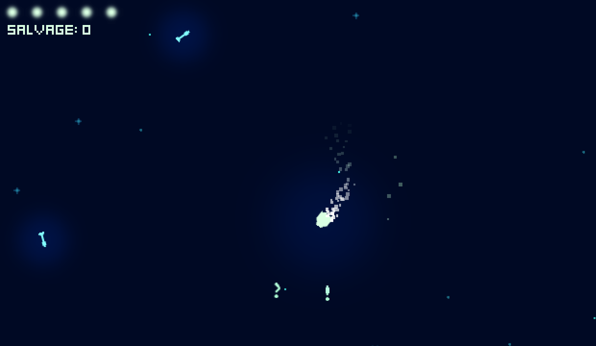

# Stellar Salvage

Salvage the debris and survive the endless enemy patrols.

### Controls

`W`, `A`, `D` - Move the ship.

`SPACE` - Shoot.

`R` - Restart the game.

---

Made in [Godot](https://godotengine.org) 4.5 for Ludum Dare 58 (48 hours).  
The game can be played here: https://ldjam.com/events/ludum-dare/58/stellar-salvage  
The source code can be found here: https://github.com/95jonpet/ld58
